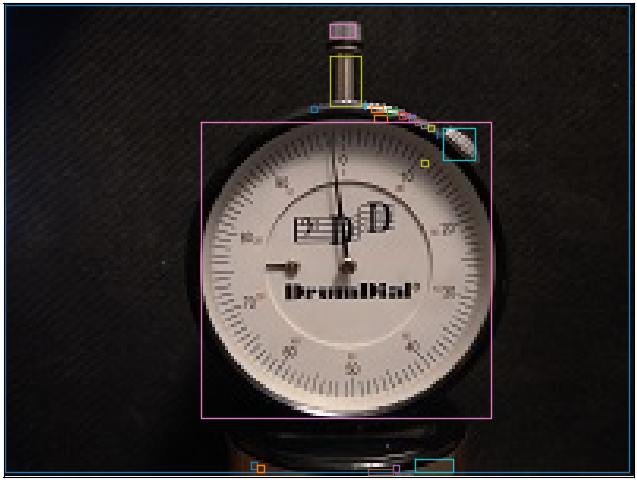

# Classical-Object-Detection
Object detection for computer vision using SKlearn's KMeans and DBSCAN




### Disclaimer
There is very likely someone who has implemented this much better than I have, but I like to learn so that is the reason for making this. I'd suggest looking into YOLO for most use cases.


## Usage
Be sure to downsample your images! The image shown above was __300px x 168px__ and took 1.5 seconds. HD images will suffer

```
from PIL import Image
import numpy as np
from cod import cod

im = np.array(Image.open('test.png'))
list_of_bboxes = cod(im, Q=5, eps=5)
```

`cod` returns a list of lists of shape __M x 4__ where M is equal to the number of bounding boxes the algorithm has found. Each bounding box has 4 parameters [cx, cy, w, h] for center_x, center_y, width, and height of the bounding box.


## Technical Details

### The basic idea is quite simple. 
_If there is a group of pixels (close in proximity) within an image that are similar in color, then they probably correspond to an object._

### How do we find similar colors?

You guessed it! __KMeans!__ First we unravel the image into an __N x 3__ dimentional matrix, where N is the number of pixels in the image. Next, we simply pass that feature matrix into a KMeans model looking for some predefined number of primary colors. This predefined number (`Q`) is one of the parameters of the function.

### How do we find clusters?

Now for each of the `Q` primary colors we found using KMeans we need to find clusters of pixels close to the respective color. This is done using DBSCAN. DBSCAN requires us to specify the maximum distance between members of the same cluster, this is what `eps` does. In the context of pixels, an `eps` of __1.0__ means all members of the same cluster must be immediately adjacent to another member in order to be considered a member.

I use Euclidean distance (p=2).

## TODO

At some point I intend to add a class intended for tracking an object in a video stream. The impetus for this class is that the most time consuming step within the algorithm is the KMeans color clustering step. In a video stream, as long as the scene is not changing, the primary colors should not change, so this step should only be computed at the start.
